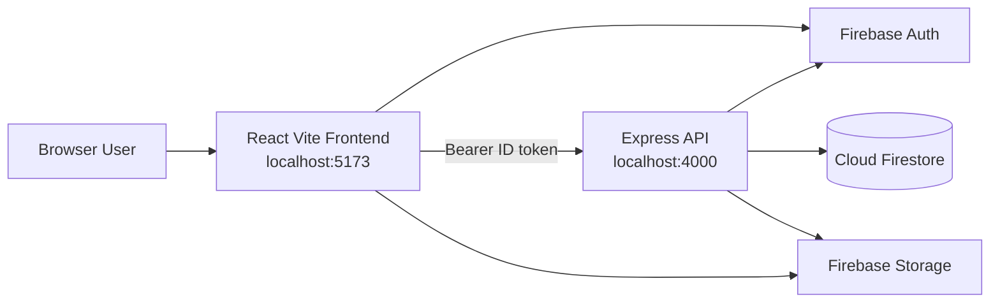
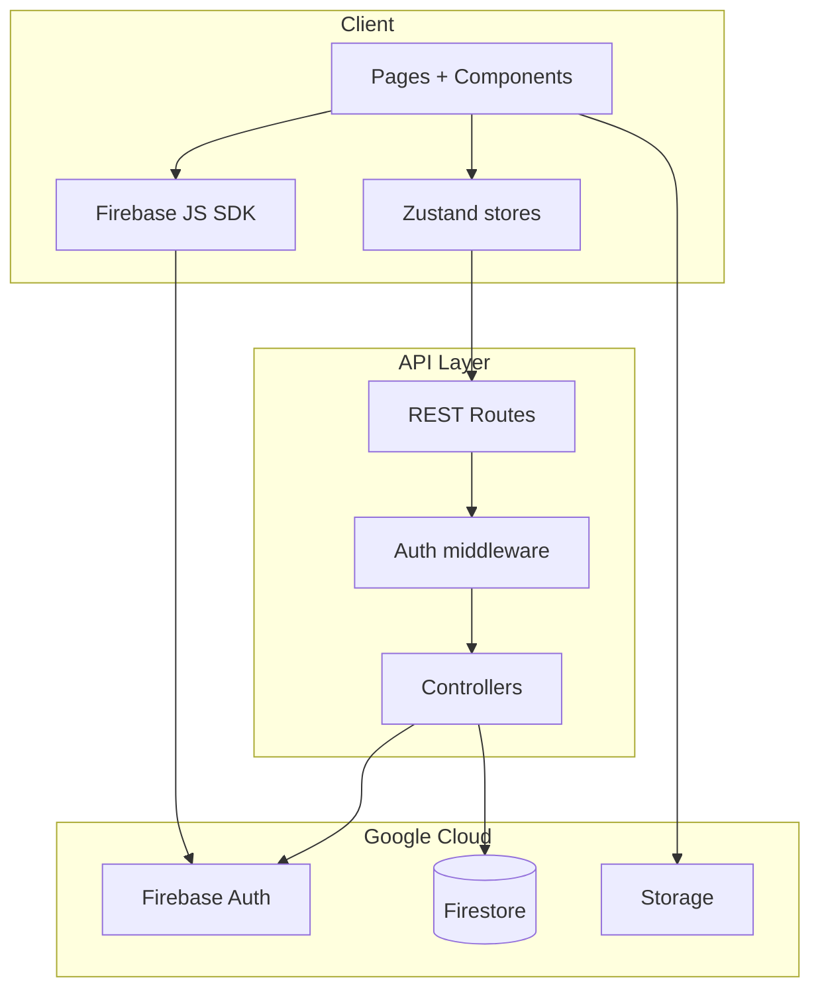

# RentNHost — High-Level Design (HLD)

## 1. Product

**RentNHost** is a peer-to-peer car rental marketplace for India.

| Role | Capabilities |
|------|----------------|
| Renter | Browse, filter, book cars; view bookings |
| Host | List cars (image + pricing), manage listings |
| System | Firebase Auth identity, Firestore data, Express API |

## 2. Context diagram

## 3. System containers

## 4. Tech stack

| Layer | Choice |
|-------|--------|
| Frontend | React 19, Vite, Tailwind 4, Framer Motion, Zustand |
| Auth | Firebase Auth (Google + email/password) |
| Backend | Node.js, Express 5 |
| Data | Cloud Firestore (`car`, `users`, `bookings`) |
| Images | Firebase Storage (S3 optional later) |
| Payments | Deferred — bookings confirm unpaid (Razorpay ready to wire) |

## 5. Environments

| Env | Frontend | API |
|-----|----------|-----|
| Local | `http://localhost:5173` | `http://localhost:4000` |
| Firebase project | `car-rental-3a89c` | Admin SDK JSON |

## 6. Non-goals (MVP overnight)

- Live Razorpay capture
- Maps / geofencing UI
- Admin console
- Chat / reviews productization
- KYC document upload workflow

## 7. Quality bar

- Light-first design system (`DESIGN_SYSTEM.md`)
- Auth-protected host/booking writes
- Smoke script: `npm run smoke` on backend
- Playwright UI validation loop overnight
