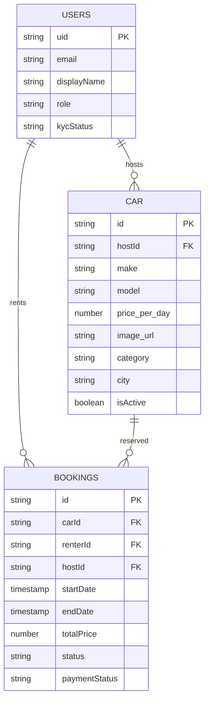
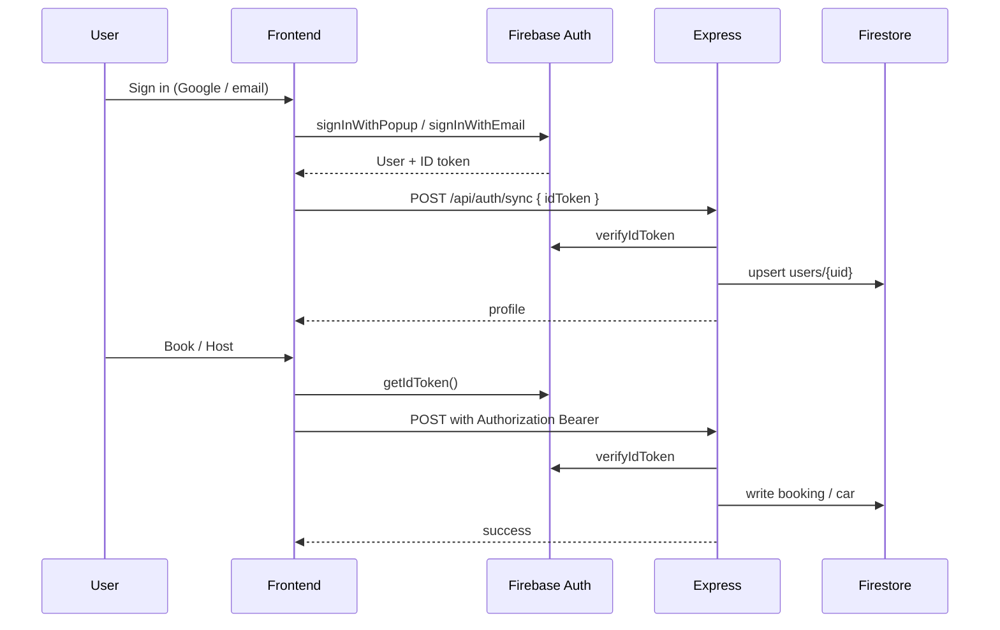
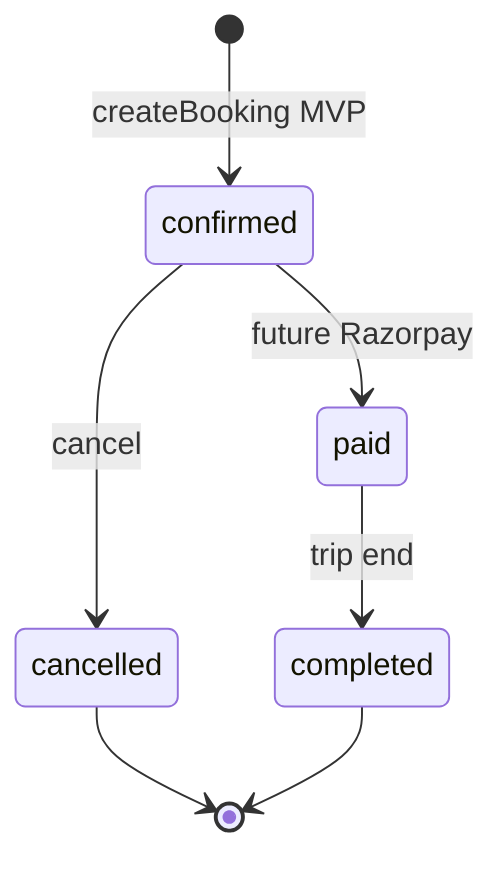

# RentNHost — Low-Level Design (LLD)

## 1. API surface

Base: `http://localhost:4000`

### Auth
| Method | Path | Auth | Body / notes |
|--------|------|------|----------------|
| POST | `/api/auth/sync` | idToken in body | Upsert Firestore user |
| GET | `/api/auth/me` | Bearer | Profile |
| PATCH | `/api/auth/me` | Bearer | Profile fields |
| GET | `/api/users/me` | Bearer | Alias |
| PATCH | `/api/users/me` | Bearer | Alias |

### Cars
| Method | Path | Auth | Notes |
|--------|------|------|--------|
| GET | `/api/cars` | — | `category`, `limit`, `city`, price filters |
| GET | `/api/cars/:id` | — | Detail + host |
| POST | `/api/cars` | Bearer | Host create |
| GET | `/api/cars/host/my-cars` | Bearer | Host inventory |
| PUT | `/api/cars/:id` | Bearer | Owner update |
| DELETE | `/api/cars/:id` | Bearer | Owner delete |

### Bookings
| Method | Path | Auth | Notes |
|--------|------|------|--------|
| POST | `/api/bookings` | Bearer | Create (status confirmed, payment unpaid) |
| GET | `/api/bookings/mine` | Bearer | `?as=host` optional |
| PUT | `/api/bookings/:id/cancel` | Bearer | Cancel |

### Locations
| Method | Path | Auth | Notes |
|--------|------|------|--------|
| GET | `/api/locations` | — | Distinct cities + fallback list |

## 2. Firestore collections

**Collection IDs:** `users`, `car`, `bookings`

## 3. Auth sequence

## 4. Frontend module map

| Module | Path | Responsibility |
|--------|------|----------------|
| Routes | `src/routes.config.jsx` | Lazy pages |
| Auth store | `src/store/useAuthStore.js` | Session + sync |
| Car store | `src/store/useCarStore.js` | Browse / host |
| Booking store | `src/store/useBookingStore.js` | Create / list |
| API client | `src/utils/api.js` | Fetch + normalizeCar |
| Theme | `src/store/useThemeStore.js` | Light default |

## 5. Booking state machine

MVP: `status=confirmed`, `paymentStatus=unpaid` at create time.

## 6. Error & security notes

- CORS allowlist: localhost + Firebase hosting
- Collections import/export: local seed tool only — lock down before public deploy
- Rotate committed service account if ever pushed to remote
- Client never trusts role from body alone for host ownership — `hostId === req.user.uid`

## 7. Test plan

| Layer | How |
|-------|-----|
| API smoke | `cd Car-Rental_backend && npm run smoke` |
| UI | Playwright navigate landing → cars → booking → host → dashboard |
| Manual | Google sign-in, list car, book car, see dashboard |
